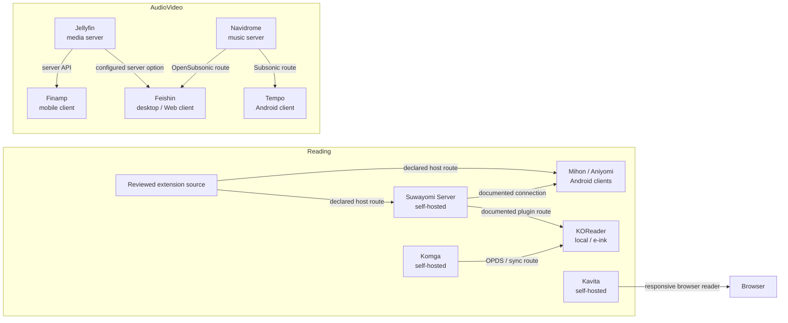

# Compatibility Matrix and Relationships — 2026-08-20

> **Review state:** This page is a dated evidence map. It distinguishes a project’s declared support from a tested configuration, and a technical connection from editorial endorsement. New catalog records remain `needs-review` until a human editor approves them.

**Tags:** [reading](Tags-and-Discovery#medium) · [video](Tags-and-Discovery#medium) · [audio](Tags-and-Discovery#medium) · [cross-platform](Tags-and-Discovery#platform) · [self-hosted](Tags-and-Discovery#platform)

## How to read the matrix

The table only records platforms and connections stated by a project’s canonical repository or documentation. A blank or **not declared** field is intentional; it is not a compatibility inference. “Local” means the application can handle the user’s own files, not that it supplies third-party content. Release numbers and commit dates are volatile: the catalog stores a dated review and source URL, while the S+ audit captures a fresh source snapshot for a human reviewer before any field is changed. This avoids publishing an outdated version as if it were current.[1] [2]

| Project | Declared role and platforms | Declared relation | Constraint or review boundary | Evidence checked |
|---|---|---|---|---|
| [Mihon](https://github.com/mihonapp/mihon) | Android reader; Android 8.0+; local reading and backups. | Client; trackers are optional integrations. | The project states that it hosts no content. Sources and extensions require separate review. | 2026-08-20 [3] |
| [Aniyomi](https://github.com/aniyomiorg/aniyomi) | Android reading and video client. | Client derived from the Mihon ecosystem. | Do not treat optional trackers or sources as bundled content or a server relationship. | 2026-08-20 [4] |
| [Suwayomi-Server](https://github.com/Suwayomi/Suwayomi-Server) | Reading server; Java/modern browser; documented bundles for Windows x64, macOS x64/arm64 and Linux x64. | Runs Mihon-compatible extensions; ships WebUI/VUI; documents Mihon and KOReader connections. | The project labels several external clients as potentially inactive or abandoned. | 2026-08-20 [5] |
| [KOReader](https://github.com/koreader/koreader) | Local e-book reader for Android, Linux and several e-ink devices. | OPDS client; documented integrations with Calibre and server plugins. | Device support is project-specific; no performance guarantee for every e-reader. | 2026-08-20 [6] |
| [Kavita](https://github.com/Kareadita/Kavita) | Cross-platform reading server with a responsive browser reader. | Server → browser for the operator’s collection. | The maintainers describe the project as beta until 1.0; core and Kavita+ claims stay separate. | 2026-08-20 [7] |
| [Komga](https://github.com/gotson/komga) | Server for comics, manga, magazines and e-books with a web UI. | Server → browser, OPDS, Kobo Sync and KOReader Sync. | Installation-platform details require the project’s installation guide, not this summary. | 2026-08-20 [8] |
| [Jellyfin](https://github.com/jellyfin/jellyfin) | Self-hosted media server. | Server API used by compatible clients; access is controlled by the operator. | A server does not establish authorization to obtain or distribute media. | 2026-08-20 [9] |
| [Finamp](https://github.com/finamp-app/finamp) | Mobile music client for Android and iOS. | Requires a Jellyfin server; supports streaming and offline downloads from that server. | Desktop availability was not treated as stable without a released desktop evidence source. | 2026-08-20 [10] |
| [Navidrome](https://github.com/navidrome/navidrome) | Self-hosted music server. | Provides the Subsonic/OpenSubsonic route used by compatible clients. | Music access remains local to the operator’s library and server policy. | 2026-08-20 [11] |
| [Feishin](https://github.com/jeffvli/feishin) | Desktop and Web music client. | Documents Jellyfin, Navidrome and OpenSubsonic server configurations. | MPV is an optional local playback complement, not a streaming service. | 2026-08-20 [12] |
| [Tempo](https://github.com/CappielloAntonio/tempo) | Android music client. | Connects to Subsonic/OpenSubsonic servers. | The project describes some offline work as in development; do not advertise it as a stable feature. | 2026-08-20 [13] |
| [Keiyoushi Extensions](https://github.com/keiyoushi/extensions-source) | Source-extension repository for compatible host applications. | Extension source → compatible host application. | A source listing does not prove lawful availability, stability or compatibility with every host release. | 2026-08-20 [14] |

## Declared relationship map

The arrows describe a declared configuration route, not automatic synchronization, shared accounts, matching libraries or permission to access an external catalog. A host–extension route remains subject to the host application’s version, the extension’s own evidence, network conditions and the user’s content choices.[1] [5] [14]

## Guide for low-resource and intermittent-network use

| Situation | Safer route | What this page does **not** claim |
|---|---|---|
| Android phone with little storage | Prefer a project’s own release route, local files, and a reversible backup before changing a reader. | That any APK mirror is current, safe or compatible with a particular device. |
| E-ink reader or low-power Linux device | Start with a declared local reader such as KOReader and use a documented OPDS/server route only when the server supports it. | That every e-ink model, plugin or sync option has been tested by Rethubs. |
| Slow or metered connection | Use small canonical releases, explicit offline downloads from a user-controlled server, and pause transfers where the project exposes that control. | That every client supports resumable downloads or background transfer. |
| Private home library | Keep media and credentials on a user-controlled server; start with the project’s access-control documentation. | That self-hosting removes rights, security, backup or network responsibilities. |

## Version, activity and review workflow

The catalog schema intentionally keeps `lastReviewed`, `canonicalUrl`, `license`, evidence links and a human `reviewStatus`; it does not copy a release number into a record unless a dated audit can cite the canonical release. The following workflow is therefore the supported route for the requested version and activity fields.

1. The S+ audit queries the canonical project source, preserves the response date and compares the declared release, repository activity, archive state, license and platform claims with the existing record.
2. A detected difference creates an evidence-bearing review item. It may be labeled **fresh evidence available**, but it never changes `needs-review` to `verified` on its own.
3. A human editor confirms the specific version, activity observation and compatibility wording, then updates the record and its review date in a reviewable change.

> A 90-day freshness threshold can create a review reminder. It must not automatically promote a project: activity can be uneven, and a source response does not evaluate maintenance quality, security, legal availability or user suitability.

## Review checklist for this matrix

| Check | Required evidence | Result when unavailable |
|---|---|---|
| Platform or architecture | Project release, installation guide or maintainer documentation. | Record **not declared**; do not extrapolate from a screenshot or community note. |
| Client–server or extension relation | Both sides, or the server/host documentation, name the connection. | Describe as a candidate or omit the arrow. |
| Release and activity | Canonical release/tag and dated repository observation. | Retain the previous reviewed value and open a review reminder. |
| Distribution | Maintainer-named release path. | Do not redirect to copied installers, mirrors or unreviewed package sites. |
| Editorial promotion | Human approval in a reviewable change. | Keep `needs-review`; no scheduled job may publish it. |

## Attribution and scope

The project repositories below are the primary technical evidence for the matrix. The user-provided plan, The Wiki, The Index, EverythingMoe, Appteka, OpenAPK, Wotaku Wiki, Miyomi, FMHY and related community indexes are credited as discovery paths under [Sources and Attribution](Sources-and-Attribution); they do not replace source-level verification. The matrix intentionally avoids adding download sources, content providers or extensions merely because an application can technically load them.

## References

[1]: Compatibility-Notes "Compatibility Notes" https://github.com/Rethubswiki/rethubs-wiki/wiki/Compatibility-Notes
[2]: ../../schemas/resource-record.schema.json "Rethubs resource-record schema" https://github.com/Rethubswiki/rethubs-wiki/blob/main/schemas/resource-record.schema.json
[3]: https://github.com/mihonapp/mihon "Mihon"
[4]: https://github.com/aniyomiorg/aniyomi "Aniyomi"
[5]: https://github.com/Suwayomi/Suwayomi-Server "Suwayomi Server"
[6]: https://github.com/koreader/koreader "KOReader"
[7]: https://github.com/Kareadita/Kavita "Kavita"
[8]: https://github.com/gotson/komga "Komga"
[9]: https://github.com/jellyfin/jellyfin "Jellyfin"
[10]: https://github.com/finamp-app/finamp "Finamp"
[11]: https://github.com/navidrome/navidrome "Navidrome"
[12]: https://github.com/jeffvli/feishin "Feishin"
[13]: https://github.com/CappielloAntonio/tempo "Tempo"
[14]: https://github.com/keiyoushi/extensions-source "Keiyoushi Extensions"
