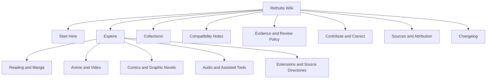

# Wiki Structure and Maintenance

> The structure favors retrieval, provenance and an explicit return path over a dense wall of links.

**Tags:** [workflow](Tags-and-Discovery#editorial-pages) · [policy](Tags-and-Discovery#editorial-pages) · [orientation](Tags-and-Discovery#editorial-pages)

## Information architecture

The map has two entry points: **Explore** for resource roles and **Collections** for media subjects. Every route leads back to a policy, compatibility or contribution page rather than leaving readers at a dead end.

## Page responsibilities

| Page class | Required elements | May not do |
|---|---|---|
| Orientation page | Purpose, stable routes, clear return paths. | Present a directory as proof of a project fact. |
| Collection page | Subject scope, resource role, evidence label and review date. | Imply content availability or a universal recommendation. |
| Resource record | Canonical origin, role, platform claim, evidence label, review date and limits. | Carry credentials, private notes, invented ratings or unsupported compatibility. |
| Policy page | Vocabulary, decision boundary and correction route. | Override a reviewer’s responsibility with automation. |
| Attribution page | Discovery source, credit and scope limit. | Claim partnership or endorsement without evidence. |

## Maintenance loop

1. A candidate or correction arrives with a canonical link.
2. A reviewer classifies the evidence and writes or updates a source-page draft.
3. The change is reviewed in a pull request.
4. A merged source change on `main` is copied to the public Wiki by the controlled publication workflow.

The workflow publishes reviewed Markdown only; it does not decide content, expose internal queue data or turn a discovery signal into a recommendation. See [Publishing Workflow](Publishing-Workflow) and [Open Entertainment Ecosystem Operations](Open-Entertainment-Ecosystem-Ops).

## Visual documentation

The companion site uses a marine–stellar identity for orientation, but semantic color is never the sole status carrier. Capture sets and the corresponding section labels live in the source repository so that visual updates remain reviewable. See [Visual Language and Accessibility](Visual-Language-and-Accessibility).
